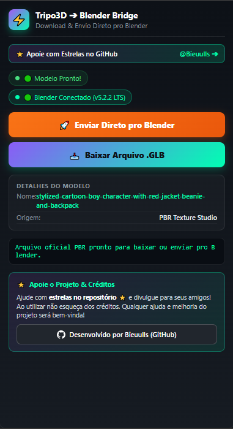

# ⚡ Tripo3D GLB Downloader & Blender Bridge

[](https://github.com/Bieuulls/TRIPO_EDGE_EXTENSION)
[](https://github.com/Bieuulls)
[](https://opensource.org/licenses/MIT)

Extensão profissional para Microsoft Edge e Google Chrome que permite **extrair e baixar modelos 3D (.GLB)** gerados na plataforma [studio.tripo3d.ai](https://studio.tripo3d.ai) com **1 clique**, além de integrar diretamente com o **Blender** via ponte HTTP local em tempo real.

<div align="center">
  <br>
  
  <br><br>
</div>

---

## ⭐ Apoie o Projeto!

> Se esta extensão foi útil para você, por favor **ajude deixando uma estrela (⭐ Star) no repositório** e divulgue para seus amigos e comunidades 3D!  
> Ao utilizar ou criar conteúdo sobre ela, **não esqueça dos créditos**.  
> Qualquer ajuda, sugestão e melhoria do projeto será extremamente bem-vinda!

👤 **Desenvolvido por:** [@Bieuulls](https://github.com/Bieuulls)

---

## ✨ Funcionalidades

- 📥 **Download de Modelos 3D (.GLB) com 1 Clique:** Detecta automaticamente o modelo renderizado na tela ou através da API interna do Tripo3D e faz o download direto para sua pasta de Downloads com texturas completas (PBR).
- 🚀 **Blender Bridge Integrado:** Envia o modelo 3D diretamente para a cena ativa do seu Blender via servidor local (porta `8766`) sem precisar importar arquivos manualmente.
- 📱 **Interface Nativa em Barra Lateral (Side Panel):** Projetada especificamente para a barra lateral do Microsoft Edge e Google Chrome, permitindo navegar no Tripo3D e monitorar modelos sem trocar de janela.
- 🔍 **Detecção Automática de Projetos:** Reconhece o ID do projeto a partir da URL da aba e recupera as URLs oficiais do asset direto da CDN.
- ⭐ **Atalhos para a Comunidade:** Botão de estrelas e créditos integrados diretamente no painel.

---

## 🚀 Como Instalar no Microsoft Edge ou Google Chrome

1. **Baixe ou clone o repositório:**
   ```bash
   git clone https://github.com/Bieuulls/TRIPO_EDGE_EXTENSION.git
   ```
2. Abra a página de extensões do navegador:
   - No Edge: `edge://extensions`
   - No Chrome: `chrome://extensions`
3. Ative a chave **"Modo do desenvolvedor"** no canto superior ou lateral.
4. Clique em **"Carregar sem compactação"** (Load unpacked).
5. Selecione a pasta da extensão (`TRIPO_EDGE_EXTENSION`).
6. Pronto! Abra o [studio.tripo3d.ai](https://studio.tripo3d.ai) e abra a extensão na barra lateral.

---

## 🎨 Como Usar a Blender Bridge

1. No Blender, inicie o servidor bridge ouvindo na porta padrão `8766`.
2. Gere ou abra qualquer modelo no **Tripo3D Studio**.
3. O status na extensão indicará **"Modelo Pronto!"** e **"Blender Conectado"**.
4. Clique em **"🚀 Enviar Direto pro Blender"** para carregar o modelo na sua cena instantaneamente, ou **"📥 Baixar Arquivo .GLB"** para salvar localmente.

---

## 🤝 Créditos & Licença

* Criado e mantido por **[Bieuulls](https://github.com/Bieuulls)**.
* Licença MIT. Sinta-se livre para contribuir via Pull Requests ou abrir Issues com sugestões!
